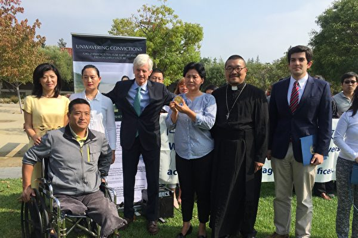

<a href=#top>
  
<a href=#1>高智晟被失踪一年 获颁自由人权奖章</a>

<a name=1>
<h1 align="center"><b>高智晟被失踪一年 获颁自由人权奖章</b></h1>

在硅谷库柏蒂诺市政厅前，大卫•乔高（左）代表第一步论坛向耿和转交了“沙赫巴兹•巴蒂自由奖”奖章。（李文净／大纪元）

【大纪元2018年08月25日讯】（大纪元记者李文净库柏蒂诺报导）中国著名维权律师高智晟被中共当局强迫失踪一年之际，总部位于芬兰的人权机构第一步论坛（First Step Forum）为其颁发2018年度自由人权奖。周五（8月24日），该机构委托加拿大前亚太司司长大卫．乔高（David Kilgour）来到湾区，向高智晟妻子耿和转交奖章。

在硅谷库柏蒂诺（Cupertino）市政厅前，大卫．乔高代表第一步论坛（First Step Forum）向耿和转交了“沙赫巴兹．巴蒂自由奖”奖章。大卫．乔高说：“高智晟为法轮功辩护，也为基督徒辩护，他多年为弱势群体发声，他是世界的英雄，我把他叫作中国的默罕默德甘地或尼尔森曼德拉。”

高智晟被誉为“当代中国最为杰出的人权律师”和“大陆维权运动的先行者”，曾经三次为受迫害的法轮功学员公开上书，曾获得诺贝尔和平奖提名。他于2014年8月从新疆沙雅监狱获释后，被软禁在陕北家乡窑洞中将近三年。2017年8月13日被中共当局强迫失踪后，迄今音讯全无，已超过一年。

耿和说：“高智晟在强制失踪379天的这个时候，颁发这个自由奖是非常有意义的，它就是来激励我们，自由的人在自由的国家里面，关注国内不自由的人们。”

当天，硅谷选区国会众议员罗康纳（Ro Khanna），也派出代表Geo Saba来向高智晟颁发褒奖，表彰他为中国人权所做出的努力。

中国民主教育基金会会长方政表示，从高智晟律师开始，中国才慢慢聚集、发展、成长了一批关注人权案例的维权律师。高智晟是一个先驱，他付出的代价也是巨大的，在国内长时间被监禁，遭受酷刑，现在再次被失踪等等。他获得这个奖项，真的是当之无愧，应该让世界人们记住他。

方政最后强调：“我们不会忘掉中共的这种残暴，不会忘掉在中共这种残酷统治下，这种受迫害的各种人士。人人都是一个中共残暴政权的受害者，所以人人都有理由，人人也都应该起来去反抗这个暴政，我想这一天会很快到来。”

华人基督徒公义团契创办人刘贻牧师发言说，高智晟律师获奖是基督徒的光荣。基督徒应该活出有真理的仁义和圣洁的样式，高智晟为此付出了极大的代价和苦难也在所不惜。他还说，中国的宗教自由状况是1980年多以来最糟糕的，这让大家更加钦佩高智晟的言论、行动、付出和坚忍。

“沙赫巴兹．巴蒂自由奖”设立于2011年，以纪念前巴基斯坦少数族裔部部长、基督徒沙赫巴兹．巴蒂（Shahbaz Bhatti），他于2011年3月2日因持续推动宗教自由而被暗杀。该奖每年发给一人，以表彰其在人权、自由、宗教方面的杰出贡献和重要影响。◇

（此文发表于1200F期旧金山湾区新闻版）

<a href=#top><h6 align="right">回上方</h6></a>
