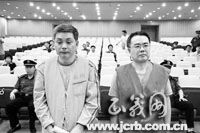
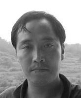

<h1 align="center"><b>诽谤法轮功 中共百名文宣官员遭恶报（上）</b></h1>

<table border="0" cellspacing="3" cellpadding="3">
<tbody>
<tr>
<td align="center"></td>
</tr>
<tr>
<td align="center">百名参与迫害法轮功的中共宣传部门的官员遭厄运。（大纪元资料库）</td>
</tr>
</tbody>
</table>

【大纪元2018年01月16日讯】自1999年中共江泽民集团对法轮功学员发起灭绝性的迫害以来，积极参与抹黑法轮功的不少宣传部门的官员厄运连连。

在江泽民集团下达的“名誉上搞臭、经济上截断、肉体上消灭”的命令下，中宣部控制2,000家报纸、数百家中央及地方电视台和广播电台，全面编造谎言，诬蔑诽谤法轮功，煽动仇恨。

对外，新华社、中新社、中通社和海外中共媒体把反法轮功的宣传扩散到海外；对内中共肆意收缴、毁坏和烧毁法轮功的出版物。

据统计，迫害开始短短的半年内，攻击法轮功的报导达三十多万篇，中共各级宣传部门开足马力，对全民洗脑。

至今，能确认的被迫害致死的法轮功学员超过4,000人，不计其数的法轮功学员被非法绑架、关于、庭审、判刑，其间遭受酷刑折磨，他们的家属也深受其害。中共的宣传机器为这场残酷的迫害推波助澜，沦为杀人的工具。

2001年中国新年前夕，江泽民、罗干导演了震惊中外的“天安门自焚”骗局，栽赃陷害法轮功，煽动民众的仇恨。

事实上，法轮功明确说明杀人、自杀是有罪的。国际教育发展组织分析了央视播放的“天安门自焚”录像，在联合国会议上公开指出“自焚”漏洞百出，是中共为迫害法轮功而制造的骗局。

由于中共垄断和封锁信息，“自焚”伪案欺骗了无数的中国民众，还被编入小学教科书中，毒害没有辨别能力的学生。

从古至今，诽谤佛法、迫害修行者遭报，应验“善恶有报”的天理。追随江泽民集团参与迫害法轮功的遭报者数以万计。据明慧网的信息，参与迫害而遭报的中共国级、省部级高官就有126名。

明慧网收录了100名中共宣传部门官员们因参与迫害法轮功遭恶报的案例，其遭报方式多种多样。

本文按四类归类列举案例：遭癌症及各种疾病身亡、自杀及事故中丧生、殃及家人、遭审查和判刑。本篇涉及前三类。

<b>一、遭癌症及各种疾病身亡</b>

<b>1. 广东省广州市委宣传部副部长汤应武突发心脏病死亡</b>

汤应武，于2011年7月至2014年5月担任《广州日报》报业集团党委书记、管委会主任，广州日报社社长，广州传媒控股有限公司董事长；于2005年10月至2011年7月担任广州市委宣传部副部长、常务副部长。2014年5月16日突发心脏病死亡，不到50岁。

据统计，截至2014年12月，《广州日报》及其下属大洋网发表了2,690篇诽谤法轮功的报导；《羊城晚报》及其下属金羊网发表了425篇；《南方日报》及其下属南方网发表了206篇。

<b>2.《羊城晚报》社长梁国标诋毁法轮功患肺癌</b>

梁国标在广东肇庆市当宣传部长兼“610”（类似于德国纳粹的盖世太保和中共的文革小组）成员时，经常写诋毁、诬蔑的文章；于2002年当上了羊城晚报集团社长，仍然在《羊城晚报》上转载有关诬蔑法轮功的文章。

他妻子于1998得法，女儿于2003年得法。母女两人多次劝奉他，他却极度仇恨法轮功，用婚姻、工作、经济等胁迫妻儿放弃修炼；收缴法轮功书籍，经常对妻子大打出手。

为掩饰其十几年婚外情的丑行，他与情妇结婚，对外声称是母女两人炼法轮功导致家庭破裂。梁国标已患肺癌。

<b>3. 原央视新闻评论部副主任陈虻丧命于胃癌肝癌</b>

陈虻，原央视新闻评论部副主任、央视“东方时空”的主管，2008年初患上胃癌和肝癌，在经历9个月的折磨后，2008年12月23日，在北京肿瘤医院死亡，年仅47岁。

他是“天安门自焚”伪案的制片人。中共利用这个“世纪伪案”在各地的监狱、劳教所、洗脑班等黑窝里强迫法轮功学员放弃修炼。陈虻公开在海外承认天安门自焚伪案是造假，说：“谁给我钱，我就给谁造假。”

中共迫害法轮功开始时，央视反复播放污蔑法轮功的谎言。当时的央视新闻联播主持人罗京，于2008年查出患淋巴癌，移植骨髓两个月后复发，并出现口腔溃疡等并发症，舌头溃烂，不能说话，连喝水都疼痛难忍，2008年6月5日死于北京307医院，时年48岁。

<b>4. 原新华社社长田聪明病亡</b>

田聪明，74岁，陕西省府谷县人，2000年6月至2008年3月，任职新华社社长。在职期间，一直追随江氏犯罪集团参与迫害刊登污蔑法轮功的文章，误导民众掀起对法轮功的仇恨。仅2000年1月至2003年10月，新华网对法轮功的诋毁文章达522篇之多。

2001年1月23日，北京天安门广场发生所谓“自焚事件”，此案疑点重重，而该事件随即被江泽民集团广泛宣传利用并借此升级镇压法轮功。时任中共新华社社长田聪明是组织“自焚伪案”的当事人之一。

<b>5. 内蒙古自治区党委宣传部副部长陈宝泉病亡</b>

陈宝泉，1991年11月调入自治区党委宣传部，先后任宣传处主任科员、新闻出版处处长、自治区党委宣传部副巡视员；2016年7月任自治区党委宣传部副部长、自治区对外宣传领导小组办公室主任，正厅级。

陈宝泉是内蒙古地区污蔑法轮功的主要责任人。2017年5月16日，在呼和浩特因病死亡，终年54岁。

<b>6. 四川省遂宁市《遂宁日报》总编陈阳荣夫妻双双患癌症丧命</b>

陈阳荣，在1999年“7.20”时，任职于遂宁市中区区委宣传部部长，负责全区诽谤法轮功的宣传舆论；2002年调入遂宁日报社任总编，他的妻子在遂宁市委宣传部工作。

2004年，陈阳荣和妻子双双患上了癌症，相继在一个月中，痛苦地死去，时年40岁左右。

<b>7. 山东胶州市宣传部部长胡金梅患癌身亡</b>

胡金梅，曾坐镇电视台，指挥炮制诬陷法轮功的假新闻，患癌症，痛苦地死去。

<b>8. 河北省故城县县宣传部长徐庆林得癌症死亡</b>

徐庆林，多次在县电视台大肆污蔑法轮功，于2002年得癌症，3、4月间死亡。

<b>9. 黑龙江方正林业局党委宣传部副部长刘晓华丧命</b>

刘晓华，40岁左右，大肆诋毁法轮功。2001年3月中旬，刘晓华召开大会，诽谤法轮功学员张亚琴，还搞了一个诬陷法轮功的条幅，让每个参与大会的人签名。没过几天，她就命丧黄泉。

<b>10. 原广东省茂名市宣传部长许木泳死于喉癌</b>

许木泳，1999年，从茂南区委书记被提升为茂名市政府副市长、市委宣传部长。在位时全市各个宣传报刊、栏物、街道、镇委听其命令，不断抹黑法轮功。2015年9月21日，患喉癌，死时68岁。

<b>11. 四川省泸州市古蔺县宣传科科长陈明权患病猝死</b>

陈明权，在其任职期间，很多法轮功学员被非法抓捕、判刑、庭审或诬判，甚至被迫害致死。2013年9月8日凌晨，他突发疾病猝死。

<b>12. 吉林省伊通县宣传部郑健暴病而死</b>

郑健，42岁，曾在伊通县委宣传部工作。2001年，他多次前去该县开办的洗脑班诬蔑法轮功、转化法轮功学员。2005年2月18日（大年初三），胸闷而暴死。

<b>13. 吉林省蛟河市松江镇宣传部主任于晓东死于肺癌</b>

于晓东参与对法轮功的污蔑宣传，于2010年8月死于肺癌。

<b>14. 山东胶州市广电局记者颜波突患肺癌而死</b>

颜波，原山东胶州市广电局记者，后调到宣传部新闻报导科当记者，后提为科长，编写污蔑法轮功的文章，时隔不久，突患肺癌死亡，年仅30岁。

<b>15. 中共安徽省政协副主席曹征海病死</b>

曹征海于2017年5月20日下午病死，终年57岁。数月前他刚转任此职。港媒此前披露，曾长期在内蒙古任职的曹征海，是以内蒙为政治老巢的江派常委刘云山的“白手套”，迫害法轮功的帮凶。

<b>16. 黑龙江汤原县原“610”主任柳昭兴患股骨头坏死</b>

柳昭兴，原任职汤原县委宣传部、该县“610”办公室的主任。在其任职期间，许多法轮功学员被非法罚款、关押，有的被判重刑10年。柳昭兴已患上股骨头坏死。

<b>17. 山西临汾市三维集团宣传部长唐笑川患癌症而死</b>

唐笑川，40余岁，多次利用集团广播诽谤法轮功。2003年夏天，得癌症死亡。

<b>18. 东北大学宣传部长孙雷得了肾结石</b>

2005年中旬，辽宁东北大学出现了很多攻击法轮功的宣传展版，甚至出现了一个迫害法轮功的“实施方案”。孙雷在参与此事后，得了肾结石和很多其它的病。

<b>二、自杀及事故中丧生</b>

<b>1. 甘肃省委宣传部副部长兼《甘肃日报》社长石星光遭杀</b>

石星光，1945年7月，1999年1月到2005年3月任甘肃省省委宣传部副部长兼甘肃日报社社长。《甘肃日报》充当了造谣和传播谎言的工具。2005年11月16日上午10时，他在兰州被刑满释放人员入室杀死。

<b>2. 河北承德市宣传部长王洪斌遭车祸死亡</b>

王洪斌，男，原保定市委常委、宣传部长，在承德市任宣传部长期间，利用报纸、电视台诬蔑诽谤法轮功，2009年11月16日在高速公路遇车祸身亡，时年52岁。

<b>3. 辽宁省凤城市宣传部长石桂萍办洗脑班第九天暴毙</b>

石桂萍，32岁。曾两次在迫害法轮功学员的洗脑班上担任主讲，在电视上攻击法轮功。2001年4月，在去洗脑班的途中被车撞死。

<b>4. 天津市宁河区政法委书记张付川在家中上吊自杀</b>

张付川，55岁，2016年2月，担任了宁河区政法委书记，同时还任区宣传部部长、区工会主席等职务。在其任职期间，5名法轮功学员被非法判刑。他曾利用现场会、展板、公开信，开展反法轮功的签名等活动。

2016年11月，因贪腐等问题被停职调查。2017年2月13日晚，在家中上吊死亡。

<b>5. 重庆市广电局局长张小川被判17年 殃及兄弟儿子</b>

1999年至2003年，张小川任重庆广电局局长（正厅级）。该系统为迫害法轮功制造舆论环境，多次开会部署编造谎言方案。

<table border="0" cellspacing="3" cellpadding="3">
<tbody>
<tr>
<td align="center"></td>
</tr>
<tr>
<td align="center">张小川（右）、张天生兄弟一同受审（网络图片）</td>
</tr>
</tbody>
</table>

2015年7月13日，张小川因犯受贿罪等被判处有期徒刑17年，被没收财产五万元；其弟张天生被判处有期徒刑12年。据悉，张小川的儿子原在重庆电视台工作，因吸毒死亡。

<b>6. 河南省项城市宣传部长陈清毅车祸身亡</b>

陈清毅，多次动员、策划项城新闻媒体污蔑法轮功，还实施对法轮功学员“转化”洗脑。2004年中秋节前夕，与妻子开车去北京，路途中被从一辆卡车上飞脱的轮胎砸死。

<b>7. 山东潍坊市临朐宣传部长受重伤</b>

1999年“7.20”前后，山东潍坊市临朐政法委、组织部、宣传部等官员去潍坊开会，布置迫害法轮功。当天返程发生重大车祸，组织部长任玉清昏迷多日，宣传部长受重伤。

<b>8. 内蒙古多伦县档案局局长刘博溺水身亡</b>

刘博，曾在宣传部工作，因污蔑法轮功后有“功”调至档案局任局长。在2004年9月份，参与绑架本单位法轮功学员去洗脑班，非法关押20多天，扣发他们的工资达5000多元，说是给县“610”交学费。2005年7月8日，游泳时溺死。

<b>9. 河北蔚县县委宣传部长副部长贾智彬遭贼袭击</b>

贾智彬，原任蔚县县委宣传部副部长、后任宋家庄镇镇长，曾参与迫害法轮功。2004年秋，被闯进家中的盗贼用斧头划伤面部。

<b>10. 黑龙江齐齐哈尔市教育局宣传部部长丛波车祸身亡</b>

丛波，2008年10月间，在齐市教育系统下达中共的文件，攻击诽谤法轮功，用“天安门自焚伪案”毒害欺骗中小学师生，举办各种反法轮功的活动。

2008年10月24日下午5点多，丛波开的车与一大铲车相撞，当场身亡。

<b>11. 广东佛山三水区委常委、宣传部长郑运安坠楼死亡</b>

2010年5月21日上午7时许，郑运安晨运时从四楼坠楼死亡。

<b>12. 黑龙江大庆市红岗区区委宣传部庞宝来跳楼自杀</b>

黑龙江大庆市红岗区政府宣传部人员庞宝来迫害法轮功，跳楼自杀。

<b>13. 江西宜春靖安县委宣传部副部长余清华车祸身亡</b>

<table border="0" cellspacing="3" cellpadding="3">
<tbody>
<tr>
<td align="center"></td>
</tr>
<tr>
<td align="center">余清华（网络图片）</td>
</tr>
</tbody>
</table>

余清华，42岁，是靖安县迫害法轮功的责任人。2017年3月28日7时2分，驾驶小客车翻车，当场死亡。

<b>14. 河北崔景华写诗歌攻击法轮功被撞死</b>

崔景华，曾任职于河北廊坊市大城县宣传部等部门，写诗歌攻击法轮功。2002年1月，自费出版诗集1000册，到处兜售散发。2003年过年期间，被撞死，曝尸街头。

<b>15. 贵州轻工职业技术学校学生会宣传部长</b>

该校校长严须经常在大会上诽谤法轮功，又指挥部分师生在学校的综合大楼贴诽谤法轮功的宣传画。2005年12月21日凌晨，该校学生会宣传部部长在回校的途中遭人追杀而死。

<b>三、殃及家人</b>

<b>1. 山西省司法厅厅长王水成</b>

王水成，曾任中共山西闻喜县县委书记，后任中共运城市委常委、宣传部长。两地都是迫害法轮功很严重的地区，他因诽谤污蔑法轮功被提拔。

他儿子20多岁，在美国留学，回国探亲期间，酒后驾车，出车祸身亡。

<b>2. 原甘肃省委副书记马西林</b>

马西林，2001年前任甘肃省委宣传部部长；2002年4月后，任甘肃省委副书记、省文明委主任、省文联主席。

马西林操控媒体迫害法轮功；他担任甘肃省委副书记时，施压、操控他人迫害致死至少 48名法轮功学员。

他家遭厄运连连。其妻死于车祸，女儿全身瘫痪、断了一只胳膊；其子酒后回家，途中肝爆裂而死。

<b>3. 河北蔚县县委宣传部长张志友</b>

张志友，2003年秋，在全县举办诽谤法轮图片展，在县电影公司反映诽谤法轮功的影片。在2005年初，宣传部制定的工作提纲中写进同法轮功作斗争一条。其妻在家中自缢身亡。

<b>4. 黑龙江鹤岗市宣传部长韩树贵</b>

韩树贵，部署全市广播、电视、报纸等新闻媒体攻击法轮功。后患病死亡，其女儿得白血病身亡。

<b>5. 辽宁省清原县宣传部干部张继仁</b>

张继仁，曾告发真相材料的法轮功学员连累家人，其子死亡。

<b>6. 辽宁省凤城市兰旗镇宣传部长郭丽华</b>

郭丽华，负责做诽谤法轮功的宣传。其夫石传胜（小学教师）敌视大法，经常攻击谩骂法轮功。2002年春，石传胜患癌症，到北京治疗，医院不收。

<b>7. 河南油田原勘探局党委宣传部部长任怀军</b>

任怀军，局里的“610”负责人之一，曾积极参与诬蔑法轮功。其子精神病加重，求医无效；其妻得乳腺癌动了大手术。

<b>8. 河北建筑工程学院原宣传处处长韩成旺</b>

韩成旺，《建工报》主编，在学院里积极收缴、焚烧法轮功书籍。2013年12月5日，其子患癌死亡。

（待续）＃

文字整理：李洁思，责任编辑：高静
